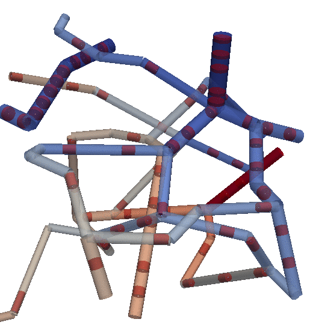
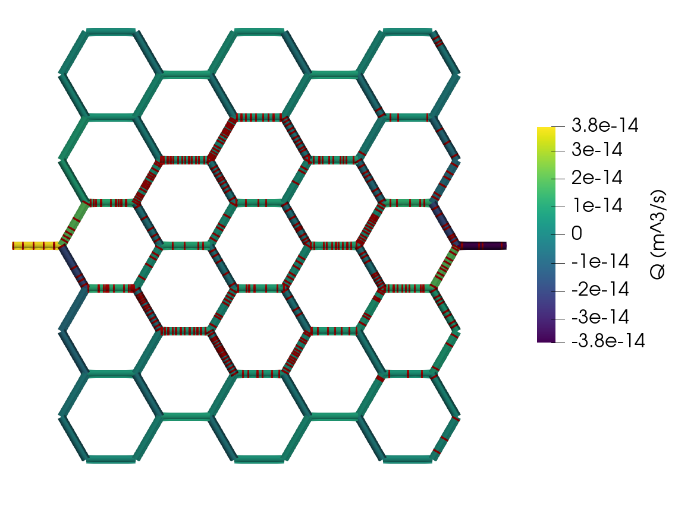

## Blood flow and RBC tracking

Implements a blood flow solver
and an RBC tracking algorithm following [Schmid (2017)](https://doi.org/10.3929/ethz-b-000199362)
based on [`DuMux` (Koch et al 2021)](https://doi.org/10.1016/j.camwa.2020.02.012)
and [`dune-foamgrid` (Sander et al 2017)](http://dx.doi.org/10.11588/ans.2017.1.28490).
The combined iterative solver allows to quantify hematocrit distribution
in microvascular networks based on simple local rules of RBC transport.
Programs take an input mesh in DGF format and input file in INI format
and output VTK files for visualization.

### Installation and example

This module comes as a DUNE module depending the core modules (v2.9),
DuMux (v3.8) and dune-foamgrid (v2.9).
To install build the Docker image and run a container or follow the
installation instructions in the Dockerfile.

Clone this repo, mount it into the Docker container at /dumux/dumux-rbc-tracking
and then configure and compile the example application like this:

```
cd /dumux/dumux-rbc-tracking && dunecontrol --current --opts=/opts/gcc.opts all
cd /dumux/dumux-rbc-tracking/build-cmake/examples && make rbcnetwork
```

and run it with default parameters like this

```
./rbcnetwork rbcnetwork.input
```

### Example output

<div>


</div>

### License

This project is licensed under the terms of the GPLv3 license or any later version at your option.
See the file [LICENSE.md](LICENSE.md) for details.
